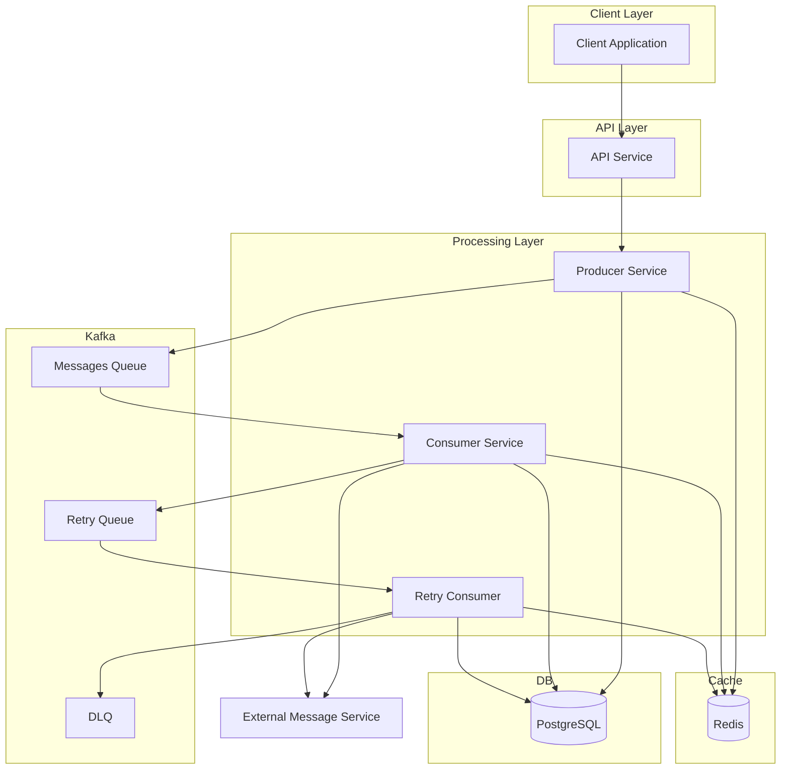
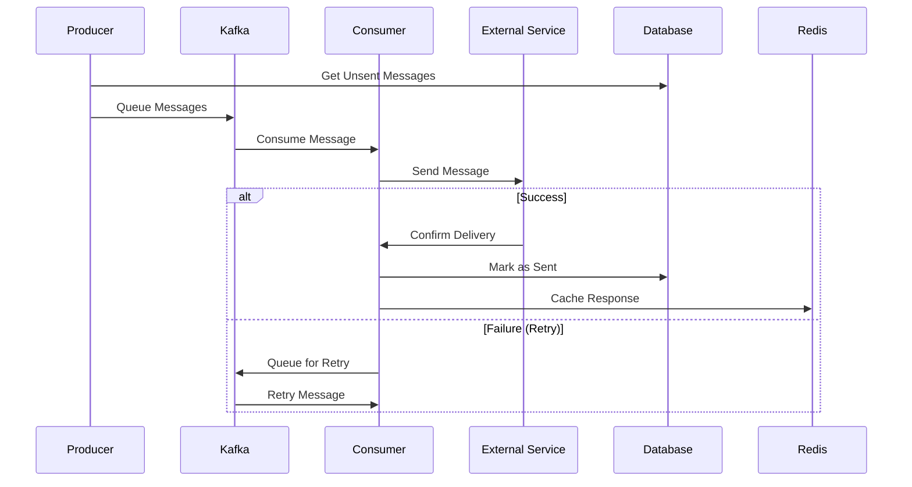
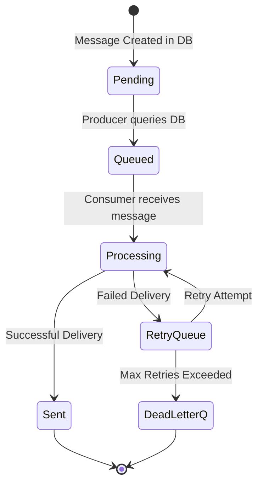

# Automatic Message System

Automatic system built in Go that handles message queuing, delivery, and retry mechanisms. The system uses Kafka for message queuing, PostgreSQL for data persistence, and Redis for caching.


## System Architecture

The system consists of several services:

- **API Service**: Handles HTTP requests and provides system status
- **Producer Service**: Queues messages for delivery
- **Consumer Service**: Processes and delivers messages
- **Retry Consumer**: Handles failed message retries
Retry mechanism can be controlled through environment variables
using different kafka topics, retry intervals and counts.

> Extra: **Test Client**: Simulates an external message service for testing

## Quick Start

- Config

1. Start the services using Docker Compose:
```bash
docker-compose up -d
```
> This will start sending the messages to the local test client.
>> The requests recieved can be inspected with `docker logs -f ams-testclient`
>> Alternatively you can change the `REQUEST_URL` environment parameter of the
>> consumer services in `docker-compose.yml` to inspect the requests sent at webhook.site

2. Add new messages with `docker exec -i postgres psql -U postgres -d automatic_message_system -f - < migrations/insertMessages.sql`
> This will add 10 more messages to the database that will be picked up by the producer.

3. In the producer `INTERVAL` and `BATCH_COUNT` env. variables can be adjusted to configure the rate of messages sent.

4. Retry logic can be configured with `RETRY_INTERVAL` and `RETRY_COUNT` env. variables in the consumers.


### Running Tests
```bash
CGO_ENABLED=1 go test -v ./...
> CGo is required for testing, it uses sqlite and may require a gcc or clang in the bin path.
> IMPORTANT: First run of tests may take a little bit too long (only first run 30-60 sec) since it probably builds C libraries in the background.
> Reference: https://github.com/mattn/go-sqlite3?tab=readme-ov-file#installation
```

### Project Structure
```
cmd/                 # Entry points
  ├── consumer/      # Consumer service entry point
  ├── http/          # API service entry point
  ├── producer/      # Producer service entry point
  └── testclient/          # Test service entry point
internal/
  ├── api/           # API service implementation
  ├── common/        # Shared utilities and interfaces
  ├── consumer/      # Consumer service implementation
  └── producer/      # Producer service implementation
migrations/          # Database migrations
```

## Monitoring

- Kafka UI available at http://localhost:8090
- Swagger UI available at http://localhost:8080/swagger/index.html

## Architecture


## Data Flow


## Message Flow

